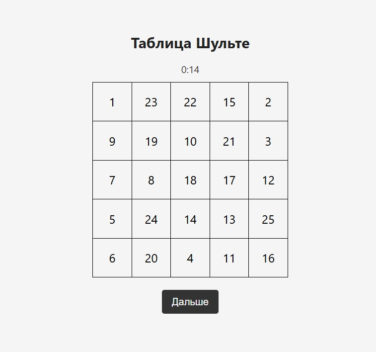

# Таблица Шульте

Минималистичное одностраничное веб-приложение для тренировки внимания, скорости реакции и концентрации.

## Описание

Это приложение представляет собой чёрно-белую таблицу Шульте 5×5, в которой числа от 1 до 25 расположены в случайном порядке. Ваша задача — как можно быстрее нажимать числа по порядку от 1 до 25.

Приложение выполнено в минималистичном стиле: только черные числа, чёрно-белая таблица, никаких отвлекающих элементов. Внизу экрана — кнопка "Начать" и простой таймер без оформления.

Идеально подходит для:

- Тренировки внимания и наблюдательности
- Улучшения зрительного восприятия
- Развития скорости мышления

## Как пользоваться

1. Нажмите кнопку **Начать**.
2. Таблица с числами появится в случайном порядке.
3. Нажимайте на числа по порядку от 1 до 25.
4. Таймер покажет, за сколько времени вы прошли таблицу.

## Особенности

- Полностью адаптивный интерфейс
- Подходит для десктопа и мобильных устройств
- Не требует установки и регистрации
- Работает прямо в браузере

## Демо

[Открыть онлайн-приложение](https://x14.github.io/shulte-table/)

## Лицензия

Проект распространяется по лицензии [MIT](LICENSE).

Автор: [xm14](https://github.com/xm14)
